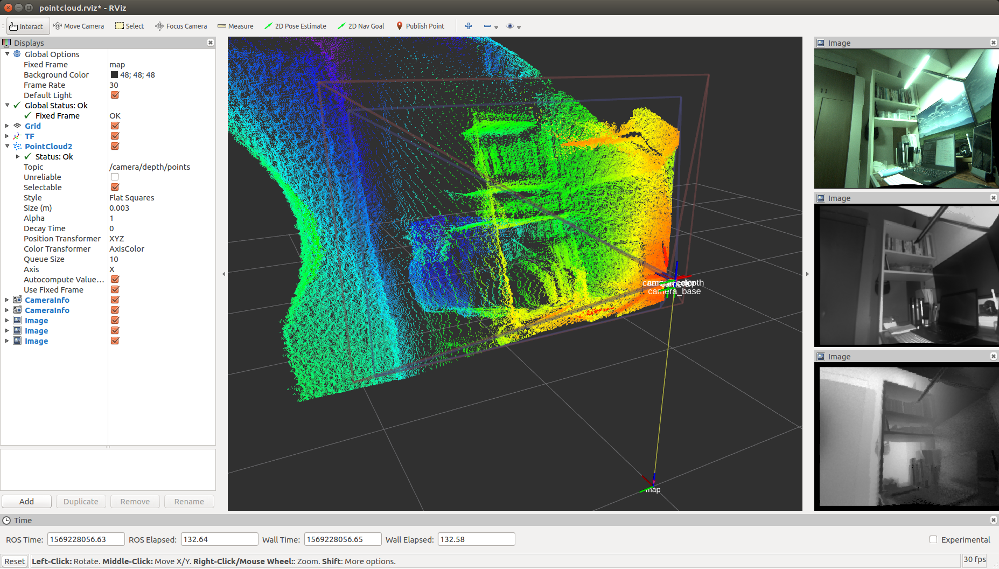
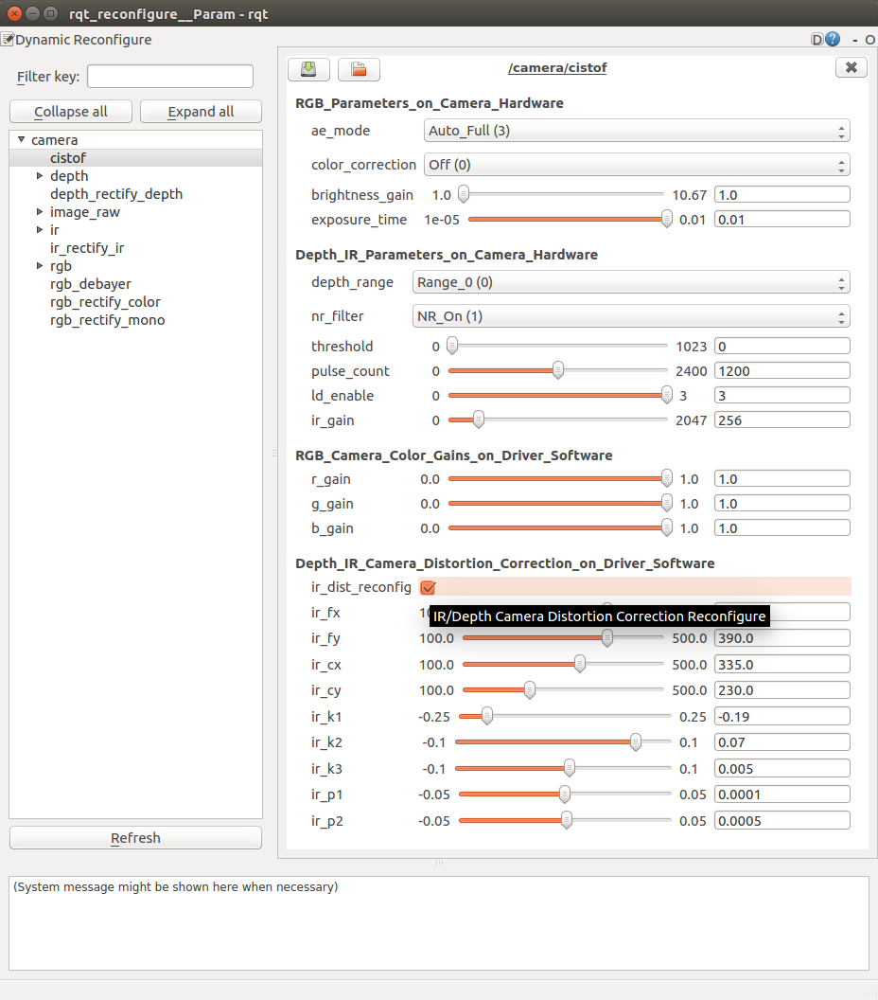
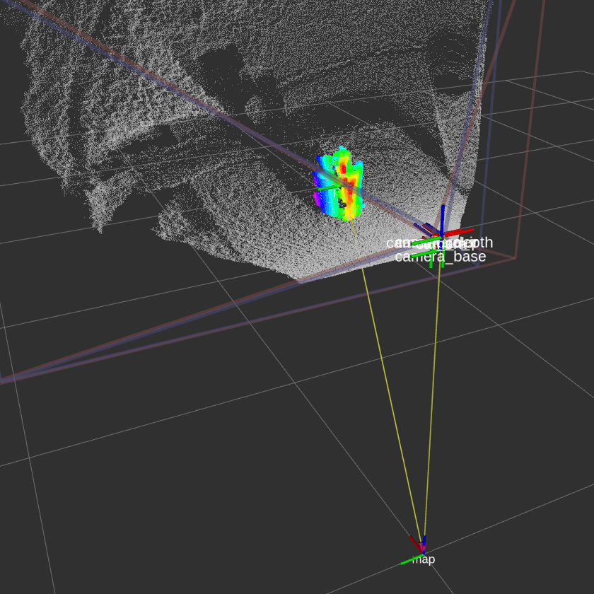

# Quick Start

## System Configurations

- OS / ROS
    - Ubuntu 16.04
        - ROS Kinetic
    - Ubuntu 18.04
        - ROS Melodic
- USB 3.0 Port
- CIS ToF Camera Sensor

## Installation

### Installing ROS

Install "ROS Desktop Full" on Ubuntu PC.

- ROS Kinetic for Ubuntu 16.04
    - http://wiki.ros.org/kinetic/Installation/Ubuntu
- ROS Melodic for Ubuntu 18.04
    - http://wiki.ros.org/melodic/Installation/Ubuntu

## Installation

```
$ source /opt/ros/$ROS_DISTRO/setup.bash
$ mkdir -p ~/camera_ws/src
$ cd ~/camera_ws/src
$ catkin_init_workspace
$ git clone https://github.com/tork-a/cis_camera.git
$ cd ~/camera_ws
$ rosdep install -y -r --from-paths src --ignore-src
$ catkin_make
$ source ~/camera_ws/devel/setup.bash
```

- **NOTE:** Replase `$ROS_DISTRO` to the ROS distribution of your system, `kinetic` or `melodic`.

## Device Permission Configuration

For the first time you start using CIS ToF camera, run `set_udev_rules` to set CIS ToF camera device permission configuration with entering sudo password in responce to program input.

```
$ source ~/camera_ws/devel/setup.bash
$ rosrun cis_camera set_udev_rules
```

- **NOTE** : This process is needed only once after the installations on your Ubuntu PC.

## Connecting Camera

1. Connect the camera to the USB 3.0 port of your Ubuntu PC
1. Connect the external power source to the camera and turn it on

## Launching Software

### PointCloud

To see the pointcloud with RViz.

```
$ source ~/camera_ws/devel/setup.bash
$ roslaunch cis_camera pointcloud.launch
```

This file launches windows of RViz and `rqt_reconfigure`.

When you do not need to launch `rqt_reconfigure`, 
please set a launch option as below.

```
$ roslaunch cis_camera pointcloud.launch reconfigure:=false
```




#### Launch Options and Default Values of pointcloud.launch

- `rviz:=true`
    - Launching RViz 
- `reconfigure:=true`
    - Launching Dynamic Reconfigure
- `camera:=camera`
    - Name of cis_camera for ROS nodes and topics
- `num_worker_threads:=4`
    - Number of threads
- `vendor:=0x2af2`
    - Vendor ID of cis_camera
- `product:=0x1001`
    - Product ID of cis_camera
- `pointcloud_rgb:=false`
    - Projecting RGB colors on the pointcloud
- `flying_pixel_filter:=false`
    - Applying flying pixel filter with PCL `VoxelGrid` and `StatisticalOutlierRemoval` filters


### Publishing Images Only

When you publish only Depth, IR and RGB images, launch `tof.launch`.

```
$ source ~/camera_ws/devel/setup.bash
$ roslaunch cis_camera tof.launch
```

If you show the images, run `rqt` and open Plugins -> Visualization -> Image View.

```
$ source ~/camera_ws/devel/setup.bash
$ rqt
```

### Dynamic Reconfigure

After you launched `pointcloud.launch reconfigure:=false` or `tof.launch`, 
you can also reconfigure Depth/IR configurations dynamically with launching `rqt_reconfigure`.

```
$ source ~/camera_ws/devel/setup.bash
$ rosrun rqt_reconfigure rqt_reconfigure
```

When you reconfigure Depth/IR camera distortion correction parameters,
check `ir_dist_reconfig` to effect parameters `ir_fx`, `ir_fy` and so on.

To set back the parameters to `config/camera_ir.yaml` data, 
uncheck `ir_dist_reconfig`.



### Frame Rate

When you want to know a frame rate of ROS topic, please run `rostopic hz` as below.

In the case of a topic `/camera/depth/points`,

```
$ source ~/camera_ws/devel/setup.bash
$ rostopic hz /camera/depth/points
```

To find out what topics exits,

```
$ source ~/camera_ws/devel/setup.bash
$ rostopic list
```

### Point Clud Library (PCL) Sample program

**Terminal 1**
```
$ source ~/camera_ws/devel/setup.bash
$ roslaunch cis_camera pointcloud.launch
```

**Terminal 2**
```
$ source ~/camera_ws/devel/setup.bash
$ rosrun cis_camera pcl_example
```

This PCL example code extracts a target object by filtering the point cloud, 
calculates the centroid of the extracted point cloud and publishes a TF on the centroid.



This example is based on "Building a Perception Pipleline" of ROS Industrial Training.

* https://industrial-training-master.readthedocs.io/en/melodic/_source/session5/Building-a-Perception-Pipeline.html
* https://industrial-training-master.readthedocs.io/en/kinetic/_source/session5/Building-a-Perception-Pipeline.html
* https://industrial-training-jp.readthedocs.io/ja/latest/_source/session5_JP/Building-a-Perception-Pipeline_JP.html


### Quit Software

Enter `Ctrl-C` on the running terminal.


# Reference

## CIS TOF Camera Specific Topics

#### Depth Image Topic

- /camera/depth/image_raw
  - Type : sensor_msgs/Image
  - Publisher : /camera/cistof
  - Default
    - Width      : 640 px
    - Height     : 480 px
    - Video Mode : gray16
  - Raw image topic with gray16 scale for depth data
- /camera/depth/image_rect
- /camera/depth/image_rect_raw

#### IR Image Topic

- /camera/ir/image_raw
  - Type : sensor_msgs/Image
  - Publisher : /camera/cistof
  - Default
    - Width      : 640 px
    - Height     : 480 px
    - Video Mode : gray16
  - Raw image topic with gray16 scale for IR image
- /camera/ir/image_rect

#### RGB Image Topic

- /camera/rgb/image_raw
  - Type : sensor_msgs/Image
  - Publisher : /camera/cistof
  - Default
    - Width      : 1280 px
    - Height     : 960 px
    - Video Mode : bgr8
  - Raw image topic with bgr8 for RGB image
- /camera/rgb/image_rect_color

#### Point Cloud Topic

- /camera/depth/points
  - Type: sensor_msgs/PointCloud2
  - Publisher : /camera/camera_nodelet_manager


## CIS TOF Camera Specific Parameters

#### depth_range

- Depth Range
    - Range 0 : Distance min: 300 [mm] - Max: 6660 [mm]
    - Range 1 : Distance min: 150 [mm] - Max: 1500 [mm]
- Value
    - Range 0 : 0
    - Range 1 : 1
- Default : 0

#### threshold

- Coring Threshold
    - Increasing the value will lower the background threshold.
- Value
    - Maximum : 0x3FFF
    - Minimum : 0
- Default : 0

#### nr_filter

- Noise Reduction Filter ON/OFF
- Value
    - NR Filter ON  : 1
    - NR Filter OFF : 0
- Default : 1

#### pulse_count

- Number of light emitting pulses per frame
    - Increasing the value improves the distance measurement accuracy.
- Value
    - Maximum : 2400
    - Minimum : 1
- Default : 1200

#### ld_enable

- Enable LEDs
    - LD1 ON : 0x0001
    - LD2 ON : 0x0002
- Value
    - Maximum : 3
    - Minimum : 0
- Default : 3

#### ir_gain

- IR Gain
- Value
    - Maximum : 2047
    - Minimum : 0
- Default : 256

#### ae_mode

- Auto exposure mode
- Value
    - Manual       : 0
    - Auto_Gain    : 1
    - Auto_Shutter : 2
    - Auto_Full    : 3
- Default      : 3

#### color_correction

- Color correction Mode
- Value
    - Off      : 0
    - Standard : 1
- Default : 0

#### brightness_gain

- RGB brightness gain
- Value
    - min :  1.0
    - Max : 10.67
- Default : 1.0

#### exposure_time

- RGB exposure time (shutter control)
- Value
    - min : 0.00001
    - MAX : 0.01 
- Default : 0.01


### How to Change Parameters

To change the parameters, 

- run `rqt_reconfigure` as mentioned above. 
    - `pointclodu.launch` runs `rqt_reconfigure` by defalut.
- add options descriptions like below when you execute a launch file.

```
$ roslaunch cis_camera pointcloud.launch nr_filter:=0 pulse_count:=1000
```

If you want to display the informations about parameters when launch files extecuted, use `--screen` option as below.

```
$ roslaunch cis_camera pointcloud.launch --screen
```


## Launch Files

### tof.launch

#### Nodes

```
$ rosnode list
/camera/camera_base_to_camera
/camera/camera_ir_to_camera_depth
/camera/camera_to_camera_color
/camera/camera_to_camera_ir
/camera/cistof
/rosout
```

#### Topics

```
$ rostopic list
/camera/camera_info
/camera/cistof/parameter_descriptions
/camera/cistof/parameter_updates
/camera/cistof/t1
/camera/cistof/t2
/camera/depth/camera_info
/camera/depth/image_raw
/camera/depth/image_raw/compressed
/camera/depth/image_raw/compressed/parameter_descriptions
/camera/depth/image_raw/compressed/parameter_updates
/camera/depth/image_raw/compressedDepth
/camera/depth/image_raw/compressedDepth/parameter_descriptions
/camera/depth/image_raw/compressedDepth/parameter_updates
/camera/depth/image_raw/theora
/camera/depth/image_raw/theora/parameter_descriptions
/camera/depth/image_raw/theora/parameter_updates
/camera/image_raw
/camera/image_raw/compressed
/camera/image_raw/compressed/parameter_descriptions
/camera/image_raw/compressed/parameter_updates
/camera/image_raw/compressedDepth
/camera/image_raw/compressedDepth/parameter_descriptions
/camera/image_raw/compressedDepth/parameter_updates
/camera/image_raw/theora
/camera/image_raw/theora/parameter_descriptions
/camera/image_raw/theora/parameter_updates
/camera/ir/camera_info
/camera/ir/image_raw
/camera/ir/image_raw/compressed
/camera/ir/image_raw/compressed/parameter_descriptions
/camera/ir/image_raw/compressed/parameter_updates
/camera/ir/image_raw/compressedDepth
/camera/ir/image_raw/compressedDepth/parameter_descriptions
/camera/ir/image_raw/compressedDepth/parameter_updates
/camera/ir/image_raw/theora
/camera/ir/image_raw/theora/parameter_descriptions
/camera/ir/image_raw/theora/parameter_updates
/camera/rgb/camera_info
/camera/rgb/image_raw
/camera/rgb/image_raw/compressed
/camera/rgb/image_raw/compressed/parameter_descriptions
/camera/rgb/image_raw/compressed/parameter_updates
/camera/rgb/image_raw/compressedDepth
/camera/rgb/image_raw/compressedDepth/parameter_descriptions
/camera/rgb/image_raw/compressedDepth/parameter_updates
/camera/rgb/image_raw/theora
/camera/rgb/image_raw/theora/parameter_descriptions
/camera/rgb/image_raw/theora/parameter_updates
/rosout
/rosout_agg
/tf
```

#### Parameters

```
$ rosparam list
/camera/cistof/ae_mode
/camera/cistof/b_gain
/camera/cistof/brightness_gain
/camera/cistof/camera_info_url
/camera/cistof/camera_info_url_color
/camera/cistof/camera_info_url_depth
/camera/cistof/camera_info_url_ir
/camera/cistof/color_correction
/camera/cistof/color_width
/camera/cistof/depth_range
/camera/cistof/exposure_time
/camera/cistof/frame_id
/camera/cistof/frame_id_color
/camera/cistof/frame_id_depth
/camera/cistof/frame_id_ir
/camera/cistof/frame_rate
/camera/cistof/g_gain
/camera/cistof/height
/camera/cistof/index
/camera/cistof/ir_cx
/camera/cistof/ir_cy
/camera/cistof/ir_dist_reconfig
/camera/cistof/ir_fx
/camera/cistof/ir_fy
/camera/cistof/ir_gain
/camera/cistof/ir_k1
/camera/cistof/ir_k2
/camera/cistof/ir_k3
/camera/cistof/ir_p1
/camera/cistof/ir_p2
/camera/cistof/ld_enable
/camera/cistof/nr_filter
/camera/cistof/product
/camera/cistof/pulse_count
/camera/cistof/r_gain
/camera/cistof/serial
/camera/cistof/threshold
/camera/cistof/timestamp_method
/camera/cistof/vendor
/camera/cistof/width
/camera/depth/image_raw/compressed/format
/camera/depth/image_raw/compressed/jpeg_quality
/camera/depth/image_raw/compressed/png_level
/camera/depth/image_raw/compressedDepth/depth_max
/camera/depth/image_raw/compressedDepth/depth_quantization
/camera/depth/image_raw/compressedDepth/png_level
/camera/depth/image_raw/theora/keyframe_frequency
/camera/depth/image_raw/theora/optimize_for
/camera/depth/image_raw/theora/quality
/camera/depth/image_raw/theora/target_bitrate
/camera/image_raw/compressed/format
/camera/image_raw/compressed/jpeg_quality
/camera/image_raw/compressed/png_level
/camera/image_raw/compressedDepth/depth_max
/camera/image_raw/compressedDepth/depth_quantization
/camera/image_raw/compressedDepth/png_level
/camera/image_raw/theora/keyframe_frequency
/camera/image_raw/theora/optimize_for
/camera/image_raw/theora/quality
/camera/image_raw/theora/target_bitrate
/camera/ir/image_raw/compressed/format
/camera/ir/image_raw/compressed/jpeg_quality
/camera/ir/image_raw/compressed/png_level
/camera/ir/image_raw/compressedDepth/depth_max
/camera/ir/image_raw/compressedDepth/depth_quantization
/camera/ir/image_raw/compressedDepth/png_level
/camera/ir/image_raw/theora/keyframe_frequency
/camera/ir/image_raw/theora/optimize_for
/camera/ir/image_raw/theora/quality
/camera/ir/image_raw/theora/target_bitrate
/camera/rgb/image_raw/compressed/format
/camera/rgb/image_raw/compressed/jpeg_quality
/camera/rgb/image_raw/compressed/png_level
/camera/rgb/image_raw/compressedDepth/depth_max
/camera/rgb/image_raw/compressedDepth/depth_quantization
/camera/rgb/image_raw/compressedDepth/png_level
/camera/rgb/image_raw/theora/keyframe_frequency
/camera/rgb/image_raw/theora/optimize_for
/camera/rgb/image_raw/theora/quality
/camera/rgb/image_raw/theora/target_bitrate
/rosdistro
/roslaunch/uris/host_robotuser_pc__44661
/rosversion
/run_id
```

### pointcloud.launch

#### Nodes

```
$ rosnode list
/camera/camera_base_to_camera
/camera/camera_ir_to_camera_depth
/camera/camera_nodelet_manager
/camera/camera_to_camera_color
/camera/camera_to_camera_ir
/camera/cistof
/camera/depth_metric
/camera/depth_metric_rect
/camera/depth_points
/camera/depth_rectify_depth
/camera/ir_rectify_ir
/camera/rgb_debayer
/camera/rgb_rectify_color
/camera/rgb_rectify_mono
/map_to_camera_base
/rosout
/rqt_reconfigure
/rviz
```

#### Topics

```
robotuser@robotuser-PC:~/camera_ws$ rostopic list
/camera/camera_info
/camera/cistof/parameter_descriptions
/camera/cistof/parameter_updates
/camera/cistof/t1
/camera/cistof/t2
/camera/depth/camera_info
/camera/depth/image
/camera/depth/image/compressed
/camera/depth/image/compressed/parameter_descriptions
/camera/depth/image/compressed/parameter_updates
/camera/depth/image/compressedDepth
/camera/depth/image/compressedDepth/parameter_descriptions
/camera/depth/image/compressedDepth/parameter_updates
/camera/depth/image/theora
/camera/depth/image/theora/parameter_descriptions
/camera/depth/image/theora/parameter_updates
/camera/depth/image_raw
/camera/depth/image_raw/compressed
/camera/depth/image_raw/compressed/parameter_descriptions
/camera/depth/image_raw/compressed/parameter_updates
/camera/depth/image_raw/compressedDepth
/camera/depth/image_raw/compressedDepth/parameter_descriptions
/camera/depth/image_raw/compressedDepth/parameter_updates
/camera/depth/image_raw/theora
/camera/depth/image_raw/theora/parameter_descriptions
/camera/depth/image_raw/theora/parameter_updates
/camera/depth/image_rect
/camera/depth/image_rect/compressed
/camera/depth/image_rect/compressed/parameter_descriptions
/camera/depth/image_rect/compressed/parameter_updates
/camera/depth/image_rect/compressedDepth
/camera/depth/image_rect/compressedDepth/parameter_descriptions
/camera/depth/image_rect/compressedDepth/parameter_updates
/camera/depth/image_rect/theora
/camera/depth/image_rect/theora/parameter_descriptions
/camera/depth/image_rect/theora/parameter_updates
/camera/depth/image_rect_raw
/camera/depth/image_rect_raw/compressed
/camera/depth/image_rect_raw/compressed/parameter_descriptions
/camera/depth/image_rect_raw/compressed/parameter_updates
/camera/depth/image_rect_raw/compressedDepth
/camera/depth/image_rect_raw/compressedDepth/parameter_descriptions
/camera/depth/image_rect_raw/compressedDepth/parameter_updates
/camera/depth/image_rect_raw/theora
/camera/depth/image_rect_raw/theora/parameter_descriptions
/camera/depth/image_rect_raw/theora/parameter_updates
/camera/depth/points
/camera/depth_rectify_depth/parameter_descriptions
/camera/depth_rectify_depth/parameter_updates
/camera/image_raw
/camera/image_raw/compressed
/camera/image_raw/compressed/parameter_descriptions
/camera/image_raw/compressed/parameter_updates
/camera/image_raw/compressedDepth
/camera/image_raw/compressedDepth/parameter_descriptions
/camera/image_raw/compressedDepth/parameter_updates
/camera/image_raw/theora
/camera/image_raw/theora/parameter_descriptions
/camera/image_raw/theora/parameter_updates
/camera/ir/camera_info
/camera/ir/image_raw
/camera/ir/image_raw/compressed
/camera/ir/image_raw/compressed/parameter_descriptions
/camera/ir/image_raw/compressed/parameter_updates
/camera/ir/image_raw/compressedDepth
/camera/ir/image_raw/compressedDepth/parameter_descriptions
/camera/ir/image_raw/compressedDepth/parameter_updates
/camera/ir/image_raw/theora
/camera/ir/image_raw/theora/parameter_descriptions
/camera/ir/image_raw/theora/parameter_updates
/camera/ir/image_rect_ir
/camera/ir/image_rect_ir/compressed
/camera/ir/image_rect_ir/compressed/parameter_descriptions
/camera/ir/image_rect_ir/compressed/parameter_updates
/camera/ir/image_rect_ir/compressedDepth
/camera/ir/image_rect_ir/compressedDepth/parameter_descriptions
/camera/ir/image_rect_ir/compressedDepth/parameter_updates
/camera/ir/image_rect_ir/theora
/camera/ir/image_rect_ir/theora/parameter_descriptions
/camera/ir/image_rect_ir/theora/parameter_updates
/camera/ir_rectify_ir/parameter_descriptions
/camera/ir_rectify_ir/parameter_updates
/camera/rgb/camera_info
/camera/rgb/image_color
/camera/rgb/image_color/compressed
/camera/rgb/image_color/compressed/parameter_descriptions
/camera/rgb/image_color/compressed/parameter_updates
/camera/rgb/image_color/compressedDepth
/camera/rgb/image_color/compressedDepth/parameter_descriptions
/camera/rgb/image_color/compressedDepth/parameter_updates
/camera/rgb/image_color/theora
/camera/rgb/image_color/theora/parameter_descriptions
/camera/rgb/image_color/theora/parameter_updates
/camera/rgb/image_mono
/camera/rgb/image_mono/compressed
/camera/rgb/image_mono/compressed/parameter_descriptions
/camera/rgb/image_mono/compressed/parameter_updates
/camera/rgb/image_mono/compressedDepth
/camera/rgb/image_mono/compressedDepth/parameter_descriptions
/camera/rgb/image_mono/compressedDepth/parameter_updates
/camera/rgb/image_mono/theora
/camera/rgb/image_mono/theora/parameter_descriptions
/camera/rgb/image_mono/theora/parameter_updates
/camera/rgb/image_raw
/camera/rgb/image_raw/compressed
/camera/rgb/image_raw/compressed/parameter_descriptions
/camera/rgb/image_raw/compressed/parameter_updates
/camera/rgb/image_raw/compressedDepth
/camera/rgb/image_raw/compressedDepth/parameter_descriptions
/camera/rgb/image_raw/compressedDepth/parameter_updates
/camera/rgb/image_raw/theora
/camera/rgb/image_raw/theora/parameter_descriptions
/camera/rgb/image_raw/theora/parameter_updates
/camera/rgb/image_rect_color
/camera/rgb/image_rect_color/compressed
/camera/rgb/image_rect_color/compressed/parameter_descriptions
/camera/rgb/image_rect_color/compressed/parameter_updates
/camera/rgb/image_rect_color/compressedDepth
/camera/rgb/image_rect_color/compressedDepth/parameter_descriptions
/camera/rgb/image_rect_color/compressedDepth/parameter_updates
/camera/rgb/image_rect_color/theora
/camera/rgb/image_rect_color/theora/parameter_descriptions
/camera/rgb/image_rect_color/theora/parameter_updates
/camera/rgb/image_rect_mono
/camera/rgb/image_rect_mono/compressed
/camera/rgb/image_rect_mono/compressed/parameter_descriptions
/camera/rgb/image_rect_mono/compressed/parameter_updates
/camera/rgb/image_rect_mono/compressedDepth
/camera/rgb/image_rect_mono/compressedDepth/parameter_descriptions
/camera/rgb/image_rect_mono/compressedDepth/parameter_updates
/camera/rgb/image_rect_mono/theora
/camera/rgb/image_rect_mono/theora/parameter_descriptions
/camera/rgb/image_rect_mono/theora/parameter_updates
/camera/rgb_debayer/parameter_descriptions
/camera/rgb_debayer/parameter_updates
/camera/rgb_rectify_color/parameter_descriptions
/camera/rgb_rectify_color/parameter_updates
/camera/rgb_rectify_mono/parameter_descriptions
/camera/rgb_rectify_mono/parameter_updates
/clicked_point
/initialpose
/move_base_simple/goal
/rosout
/rosout_agg
/tf
/tf_static
```

#### Parameters

```
$ rosparam list
/camera/camera_nodelet_manager/num_worker_threads
/camera/cistof/ae_mode
/camera/cistof/b_gain
/camera/cistof/brightness_gain
/camera/cistof/camera_info_url
/camera/cistof/camera_info_url_color
/camera/cistof/camera_info_url_depth
/camera/cistof/camera_info_url_ir
/camera/cistof/color_correction
/camera/cistof/color_width
/camera/cistof/depth_range
/camera/cistof/exposure_time
/camera/cistof/frame_id
/camera/cistof/frame_id_color
/camera/cistof/frame_id_depth
/camera/cistof/frame_id_ir
/camera/cistof/frame_rate
/camera/cistof/g_gain
/camera/cistof/height
/camera/cistof/index
/camera/cistof/ir_cx
/camera/cistof/ir_cy
/camera/cistof/ir_dist_reconfig
/camera/cistof/ir_fx
/camera/cistof/ir_fy
/camera/cistof/ir_gain
/camera/cistof/ir_k1
/camera/cistof/ir_k2
/camera/cistof/ir_k3
/camera/cistof/ir_p1
/camera/cistof/ir_p2
/camera/cistof/ld_enable
/camera/cistof/nr_filter
/camera/cistof/product
/camera/cistof/pulse_count
/camera/cistof/r_gain
/camera/cistof/serial
/camera/cistof/threshold
/camera/cistof/timestamp_method
/camera/cistof/vendor
/camera/cistof/width
/camera/depth/image/compressed/format
/camera/depth/image/compressed/jpeg_quality
/camera/depth/image/compressed/png_level
/camera/depth/image/compressedDepth/depth_max
/camera/depth/image/compressedDepth/depth_quantization
/camera/depth/image/compressedDepth/png_level
/camera/depth/image/theora/keyframe_frequency
/camera/depth/image/theora/optimize_for
/camera/depth/image/theora/quality
/camera/depth/image/theora/target_bitrate
/camera/depth/image_raw/compressed/format
/camera/depth/image_raw/compressed/jpeg_quality
/camera/depth/image_raw/compressed/png_level
/camera/depth/image_raw/compressedDepth/depth_max
/camera/depth/image_raw/compressedDepth/depth_quantization
/camera/depth/image_raw/compressedDepth/png_level
/camera/depth/image_raw/theora/keyframe_frequency
/camera/depth/image_raw/theora/optimize_for
/camera/depth/image_raw/theora/quality
/camera/depth/image_raw/theora/target_bitrate
/camera/depth/image_rect/compressed/format
/camera/depth/image_rect/compressed/jpeg_quality
/camera/depth/image_rect/compressed/png_level
/camera/depth/image_rect/compressedDepth/depth_max
/camera/depth/image_rect/compressedDepth/depth_quantization
/camera/depth/image_rect/compressedDepth/png_level
/camera/depth/image_rect/theora/keyframe_frequency
/camera/depth/image_rect/theora/optimize_for
/camera/depth/image_rect/theora/quality
/camera/depth/image_rect/theora/target_bitrate
/camera/depth/image_rect_raw/compressed/format
/camera/depth/image_rect_raw/compressed/jpeg_quality
/camera/depth/image_rect_raw/compressed/png_level
/camera/depth/image_rect_raw/compressedDepth/depth_max
/camera/depth/image_rect_raw/compressedDepth/depth_quantization
/camera/depth/image_rect_raw/compressedDepth/png_level
/camera/depth/image_rect_raw/theora/keyframe_frequency
/camera/depth/image_rect_raw/theora/optimize_for
/camera/depth/image_rect_raw/theora/quality
/camera/depth/image_rect_raw/theora/target_bitrate
/camera/depth_rectify_depth/interpolation
/camera/image_raw/compressed/format
/camera/image_raw/compressed/jpeg_quality
/camera/image_raw/compressed/png_level
/camera/image_raw/compressedDepth/depth_max
/camera/image_raw/compressedDepth/depth_quantization
/camera/image_raw/compressedDepth/png_level
/camera/image_raw/theora/keyframe_frequency
/camera/image_raw/theora/optimize_for
/camera/image_raw/theora/quality
/camera/image_raw/theora/target_bitrate
/camera/ir/image_raw/compressed/format
/camera/ir/image_raw/compressed/jpeg_quality
/camera/ir/image_raw/compressed/png_level
/camera/ir/image_raw/compressedDepth/depth_max
/camera/ir/image_raw/compressedDepth/depth_quantization
/camera/ir/image_raw/compressedDepth/png_level
/camera/ir/image_raw/theora/keyframe_frequency
/camera/ir/image_raw/theora/optimize_for
/camera/ir/image_raw/theora/quality
/camera/ir/image_raw/theora/target_bitrate
/camera/ir/image_rect_ir/compressed/format
/camera/ir/image_rect_ir/compressed/jpeg_quality
/camera/ir/image_rect_ir/compressed/png_level
/camera/ir/image_rect_ir/compressedDepth/depth_max
/camera/ir/image_rect_ir/compressedDepth/depth_quantization
/camera/ir/image_rect_ir/compressedDepth/png_level
/camera/ir/image_rect_ir/theora/keyframe_frequency
/camera/ir/image_rect_ir/theora/optimize_for
/camera/ir/image_rect_ir/theora/quality
/camera/ir/image_rect_ir/theora/target_bitrate
/camera/ir_rectify_ir/interpolation
/camera/rgb/image_color/compressed/format
/camera/rgb/image_color/compressed/jpeg_quality
/camera/rgb/image_color/compressed/png_level
/camera/rgb/image_color/compressedDepth/depth_max
/camera/rgb/image_color/compressedDepth/depth_quantization
/camera/rgb/image_color/compressedDepth/png_level
/camera/rgb/image_color/theora/keyframe_frequency
/camera/rgb/image_color/theora/optimize_for
/camera/rgb/image_color/theora/quality
/camera/rgb/image_color/theora/target_bitrate
/camera/rgb/image_mono/compressed/format
/camera/rgb/image_mono/compressed/jpeg_quality
/camera/rgb/image_mono/compressed/png_level
/camera/rgb/image_mono/compressedDepth/depth_max
/camera/rgb/image_mono/compressedDepth/depth_quantization
/camera/rgb/image_mono/compressedDepth/png_level
/camera/rgb/image_mono/theora/keyframe_frequency
/camera/rgb/image_mono/theora/optimize_for
/camera/rgb/image_mono/theora/quality
/camera/rgb/image_mono/theora/target_bitrate
/camera/rgb/image_raw/compressed/format
/camera/rgb/image_raw/compressed/jpeg_quality
/camera/rgb/image_raw/compressed/png_level
/camera/rgb/image_raw/compressedDepth/depth_max
/camera/rgb/image_raw/compressedDepth/depth_quantization
/camera/rgb/image_raw/compressedDepth/png_level
/camera/rgb/image_raw/theora/keyframe_frequency
/camera/rgb/image_raw/theora/optimize_for
/camera/rgb/image_raw/theora/quality
/camera/rgb/image_raw/theora/target_bitrate
/camera/rgb/image_rect_color/compressed/format
/camera/rgb/image_rect_color/compressed/jpeg_quality
/camera/rgb/image_rect_color/compressed/png_level
/camera/rgb/image_rect_color/compressedDepth/depth_max
/camera/rgb/image_rect_color/compressedDepth/depth_quantization
/camera/rgb/image_rect_color/compressedDepth/png_level
/camera/rgb/image_rect_color/theora/keyframe_frequency
/camera/rgb/image_rect_color/theora/optimize_for
/camera/rgb/image_rect_color/theora/quality
/camera/rgb/image_rect_color/theora/target_bitrate
/camera/rgb/image_rect_mono/compressed/format
/camera/rgb/image_rect_mono/compressed/jpeg_quality
/camera/rgb/image_rect_mono/compressed/png_level
/camera/rgb/image_rect_mono/compressedDepth/depth_max
/camera/rgb/image_rect_mono/compressedDepth/depth_quantization
/camera/rgb/image_rect_mono/compressedDepth/png_level
/camera/rgb/image_rect_mono/theora/keyframe_frequency
/camera/rgb/image_rect_mono/theora/optimize_for
/camera/rgb/image_rect_mono/theora/quality
/camera/rgb/image_rect_mono/theora/target_bitrate
/camera/rgb_debayer/debayer
/camera/rgb_rectify_color/interpolation
/camera/rgb_rectify_mono/interpolation
/rosdistro
/roslaunch/uris/host_robotuser_pc__36077
/rosversion
/run_id
```

<!-- EOF  -->
