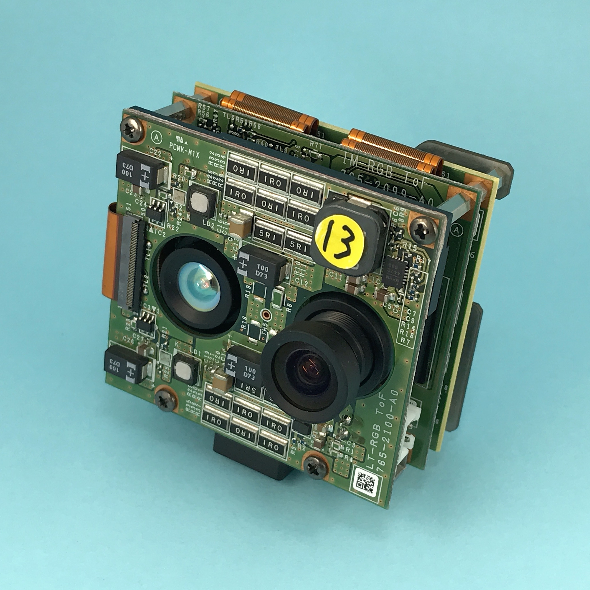
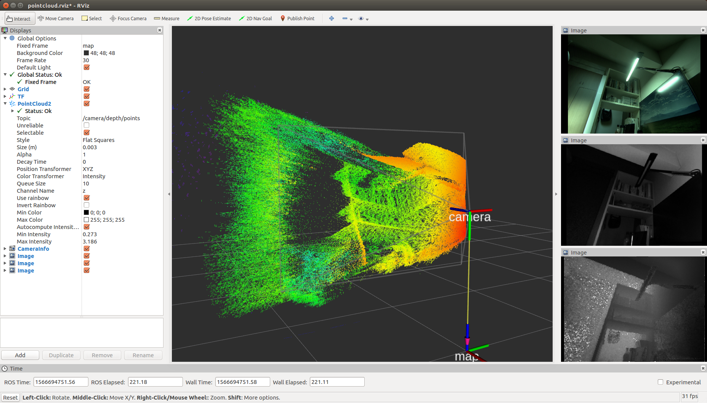
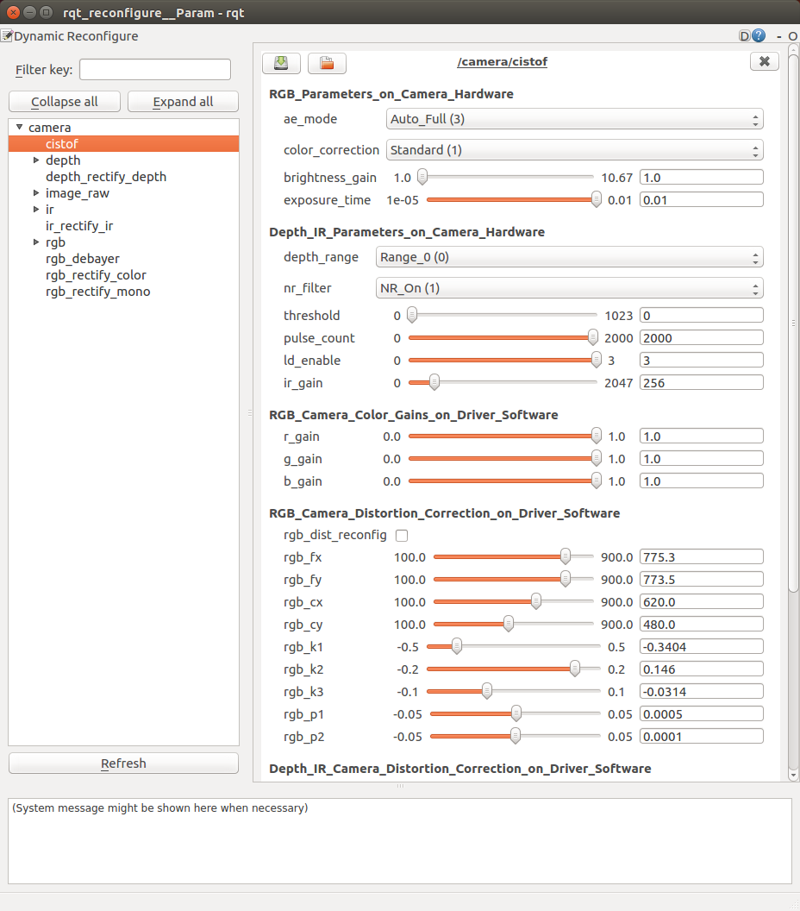
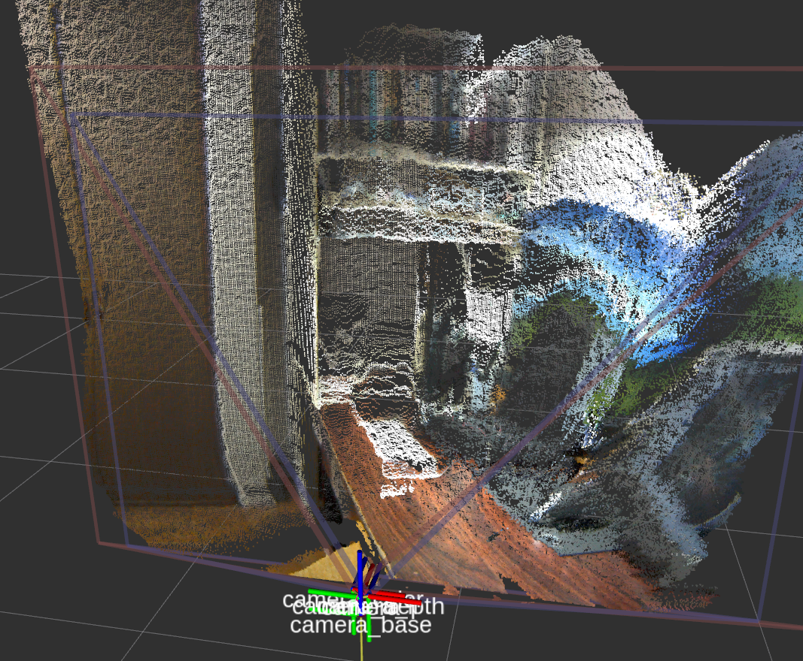
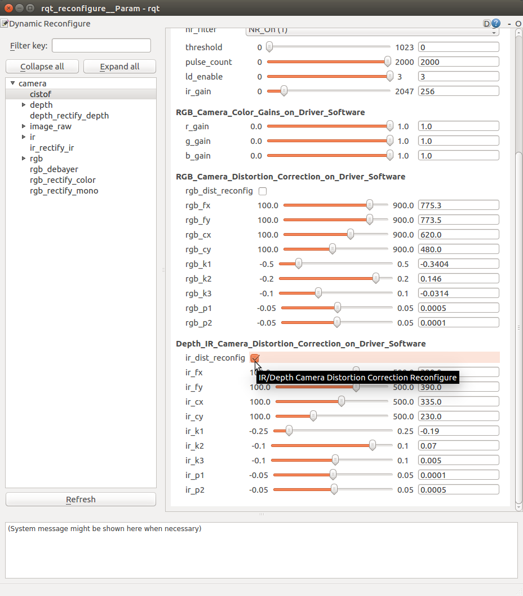

# cis_camera [](https://travis-ci.org/tork-a/cis_camera)

This package contains ROS driver nodes for CIS Corporation ToF Camera Sensor DCC-RGBD1 with USB 3.0 interface.

## System Configurations

- OS / ROS
    - Ubuntu 16.04 / ROS Kinetic
    - Ubuntu 18.04 / ROS Melodic
- USB 3.0 Port
- CIS ToF Camera Sensor DCC-RGBD1

## CIS ToF Camera Sensor DCC-RGBD1

- Camera system
    - Dimensions : H:50mm x W:55mm x D:35mm ( Protruding parts are not included )
    - Weight : 110 g
    - Frame rate : 30 fps
- RGB camera
    - 1/3” CMOS image sensor
    - Global shutter operation
    - QVGA : 1280 x 960
    - M12 lens
- Depth / IR camera
    - 1/4” CCD image sensor
    - VGA : 640 x 480
    - M12 lens
    - Output : Depth and IR images
    - Depth sensing type: ToF ( Time-of-Flight )
    - Depth range
        - mode 0 : 300 - 5000 mm
        - mode 1 : 150 - 700 mm
- NIR light source
    - 2 Laser Diodes : 850nm / Class 1
- USB output
    - USB 3.0 micro B
    - UVC interface
    - Images
        - RGB : YUV422 - 1920 × 960
        - IR : Gray 16bit - 640 × 480
        - Depth : Gray 16bit - 640 × 480
- Power source
  - DC 12V, 3A



# Quick Start

## Installation

### Installing ROS

Install "ROS Desktop Full" on Ubuntu PC.

- ROS Kinetic for Ubuntu 16.04
    - http://wiki.ros.org/kinetic/Installation/Ubuntu
- ROS Melodic for Ubuntu 18.04
    - http://wiki.ros.org/melodic/Installation/Ubuntu

## Installation of cis_camera

```
$ source /opt/ros/$ROS_DISTRO/setup.bash
$ mkdir -p ~/camera_ws/src
$ cd ~/camera_ws/src
$ catkin_init_workspace
$ git clone https://github.com/tork-a/cis_camera.git
$ cd ~/camera_ws
$ rosdep install -y -r --from-paths src --ignore-src
$ catkin_make
$ source ~/camera_ws/devel/setup.bash
```

- **NOTE:** Replase `$ROS_DISTRO` to the ROS distribution of your system, `kinetic` or `melodic`.

## Device Permission Configuration

For the first time you start using CIS ToF camera, run `set_udev_rules` to set CIS ToF camera device permission configuration with entering sudo password in responce to program input.

```
$ source ~/camera_ws/devel/setup.bash
$ rosrun cis_camera set_udev_rules
```

- **NOTE** : This process is needed only once after the installations on your Ubuntu PC.

## Connecting Camera

1. Connect the camera to the USB 3.0 port of your Ubuntu PC
1. Connect the external power source to the camera and turn it on

- **NOTE** : It takes about 4 seconds for the camera to start up normally after the external power is turned on.

## Launching Software

### PointCloud

To see the pointcloud with RViz.

```
$ source ~/camera_ws/devel/setup.bash
$ roslaunch cis_camera pointcloud.launch
```

This file launches windows of RViz and `rqt_reconfigure`.

When you do not need to launch `rqt_reconfigure`, 
please set a launch option as below.

```
$ roslaunch cis_camera pointcloud.launch reconfigure:=false
```





#### Launch Options and Default Values of pointcloud.launch

- `rviz:=true`
    - Launching RViz 
- `reconfigure:=true`
    - Launching Dynamic Reconfigure
- `camera:=camera`
    - Name of cis_camera for ROS nodes and topics
- `num_worker_threads:=4`
    - Number of threads
- `vendor:=0x2af2`
    - Vendor ID of cis_camera
- `product:=0x1001`
    - Product ID of cis_camera
- `pointcloud_rgb:=false`
    - Projecting RGB colors on the pointcloud
- `flying_pixel_filter:=false`
    - Applying flying pixel filter with PCL `VoxelGrid` and `StatisticalOutlierRemoval` filters



### Publishing Images Only

When you publish only Depth, IR and RGB images, launch `tof.launch`.

```
$ source ~/camera_ws/devel/setup.bash
$ roslaunch cis_camera tof.launch
```

If you show the images, run `rqt` and open Plugins -> Visualization -> Image View.

```
$ source ~/camera_ws/devel/setup.bash
$ rqt
```

### Dynamic Reconfigure

After you launched `pointcloud.launch reconfigure:=false` or `tof.launch`, 
you can also reconfigure Depth/IR configurations dynamically with launching `rqt_reconfigure`.

```
$ source ~/camera_ws/devel/setup.bash
$ rosrun rqt_reconfigure rqt_reconfigure
```

When you reconfigure Depth/IR camera distortion correction parameters,
check `ir_dist_reconfig` to effect parameters `ir_fx`, `ir_fy` and so on.

To set back the parameters to `config/camera_ir.yaml` data, 
uncheck `ir_dist_reconfig`.



### Frame Rate

When you want to know a frame rate of ROS topic, please run `rostopic hz` as below.

In the case of a topic `/camera/depth/points`,

```
$ source ~/camera_ws/devel/setup.bash
$ rostopic hz /camera/depth/points
```

To find out what topics exits,

```
$ source ~/camera_ws/devel/setup.bash
$ rostopic list
```

### Point Clud Library (PCL) Sample program

**Terminal 1**
```
$ source ~/camera_ws/devel/setup.bash
$ roslaunch cis_camera pointcloud.launch
```

**Terminal 2**
```
$ source ~/camera_ws/devel/setup.bash
$ rosrun cis_camera pcl_example
```

This PCL example code extracts a target object by filtering the point cloud, 
calculates the centroid of the extracted point cloud and publishes a TF on the centroid.


This example is based on "Building a Perception Pipleline" of ROS Industrial Training.

* https://industrial-training-master.readthedocs.io/en/melodic/_source/session5/Building-a-Perception-Pipeline.html
* https://industrial-training-master.readthedocs.io/en/kinetic/_source/session5/Building-a-Perception-Pipeline.html
* https://industrial-training-jp.readthedocs.io/ja/latest/_source/session5_JP/Building-a-Perception-Pipeline_JP.html


### Quit Software

Enter `Ctrl-C` on the running terminal.


<!-- EOF  -->
