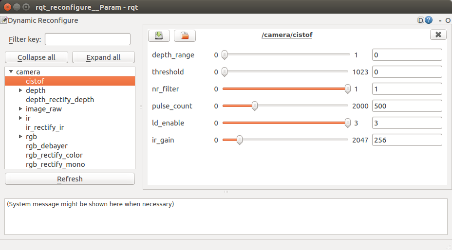

# Quick Start

## System Configurations

- Ubuntu 16.04
    - ROS Kinetic
- Ubuntu 18.04
    - ROS Melodic
- USB 3.0 Port

## Installation

### Installing ROS

Install ROS Desktop Full on Ubuntu PC.

- ROS Kinetic for Ubuntu 16.04
    - http://wiki.ros.org/kinetic/Installation/Ubuntu
- ROS Melodic for Ubuntu 18.04
    - http://wiki.ros.org/melodic/Installation/Ubuntu

### Catkin Workspace Preparation

```
$ source /opt/ros/$ROS_DISTRO/setup.bash
$ mkdir -p ~/camera_ws/src
$ cd ~/camera_ws/src
$ catkin_init_workspace
```

- **NOTE:** Replase `$ROS_DISTRO` to the ROS distribution of your system, `kinetic` or `melodic`.

### ToF Camera ROS Driver Software Codes

Unzip "cis_camera.zip" in Ubuntu and put `cis_camera` folder in `~/camera_ws/src`.

- **NOTE:** Please DO NOT uncompress the ZIP file in MS Windows because file permissions are lost. 

### Build

```
$ cd ~/camera_ws
$ rosdep install -y -r --from-paths src --ignore-src
$ catkin_make
$ source ~/camera_ws/devel/setup.bash
```

## Connecting Camera

Please connect the camera to the USB 3.0 port of your Ubuntu PC.

## Launching Software

### PointCloud

To see the pointcloud with RViz,

```
$ source ~/camera_ws/devel/setup.bash
$ roslaunch cis_camera pointcloud.launch
```

#### NOTICE

At the first launch, you will get a device permission error like below.

```
$ source ~/camera_ws/devel/setup.bash
$ roslaunch cis_camera pointcloud.launch

...

[ERROR] [1553240805.160155192]: Permission denied opening /dev/bus/usb/002/018

...

```

The port number of the device is different every time,
please replace it each time.

Change the permission of the port displayed in the error by the following method,
and execute the launch file again.

```
$ sudo chmod o+w /dev/bus/usb/002/018
```


### Publishing Images Only

When you publish only Depth, IR and RGB images, launch `tof.launch`.

```
$ source ~/camera_ws/devel/setup.bash
$ roslaunch cis_camera tof.launch
```

If you show the images, run `rqt` and open Plugins -> Visualization -> Image View.

```
$ source ~/camera_ws/devel/setup.bash
$ rqt
```

### Dynamic Reconfigure

After you launched `pointcloud.launch` or `tof.launch`, 
you can reconfigure Depth/IR configurations dynamically with `rqt_reconfigure`.

```
$ source ~/camera_ws/devel/setup.bash
$ rosrun rqt_reconfigure rqtreconfigure
```




### Quit Software

Enter `Ctrl-C` on the running terminal.

<!-- EOF  -->
